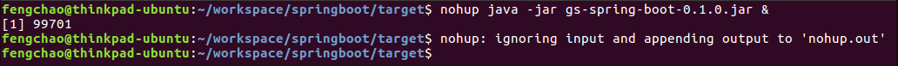

## nohup ##
> nohup命令会将后面命令的输出转向一个nohup.out文件。如果最后跟了一个&符号，那么Ctrl+c或退出终端都不会中断后台进程的运行。  

>nohup代表后台运行，nohup相当于是把你的程序托管给nohup，但是如果你不后台运行的话，你的nohup会占掉terninmal运行，那么你terminal一关，你程序还是跪了。但是你如果后台运行nohup，那么你的nohup就不会占着terminal，这样就可以后台运行了

以上引文作者：咕咕
链接：https://www.zhihu.com/question/40910876/answer/88775525
来源：知乎

**实例：**  
`nohup java -jar gs-spring-boot-0.1.0.jar &`  

